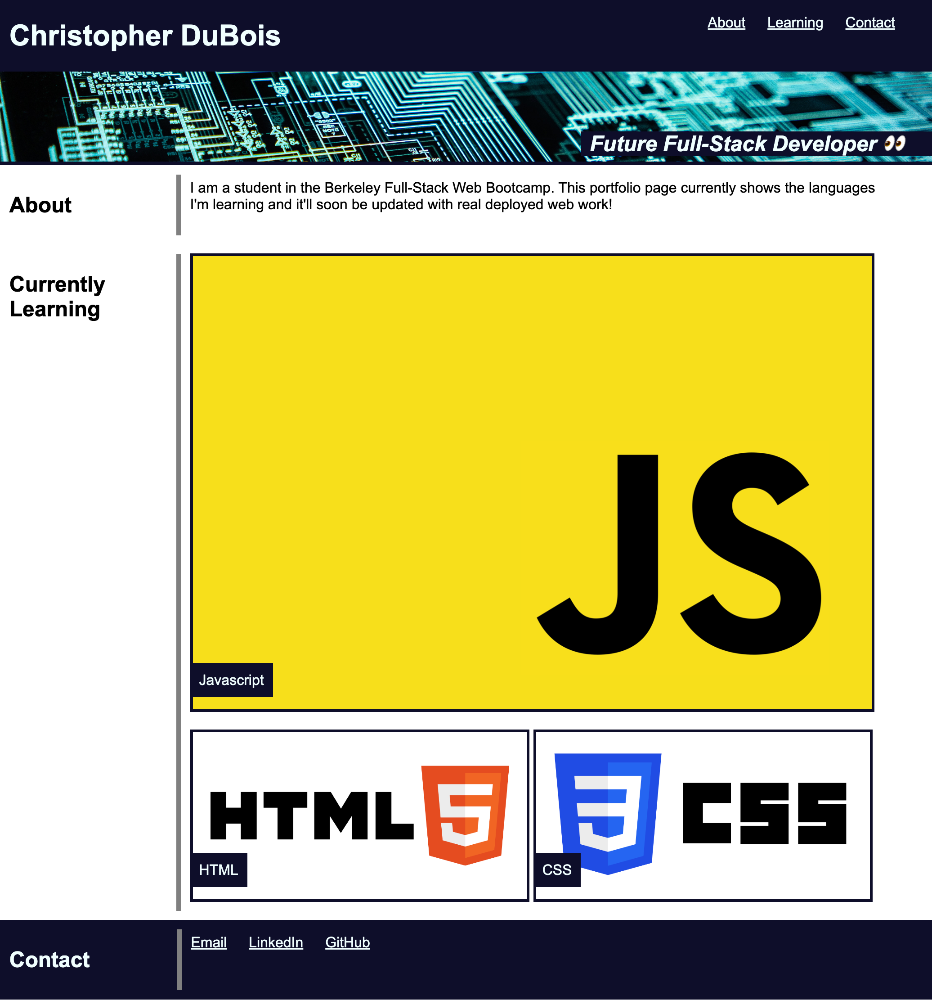
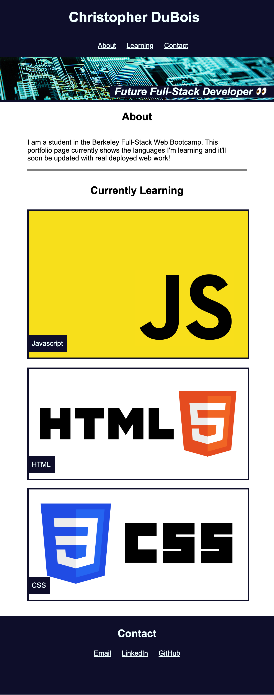

# Portfolio Page

## Description

This is a basic portfolio page started in week 2 of the bootcamp. As I deploy new projects, I can add them here and have a professional portfolio to serve me in my job search.

```
The acceptance criteria was as follows:
GIVEN I need to sample a potential employee's previous work
WHEN I load their portfolio
THEN I am presented with the developer's name, a recent photo or avatar, and links to sections about them, their work, and how to contact them
WHEN I click one of the links in the navigation
THEN the UI scrolls to the corresponding section
WHEN I click on the link to the section about their work
THEN the UI scrolls to a section with titled images of the developer's applications
WHEN I am presented with the developer's first application
THEN that application's image should be larger in size than the others
WHEN I click on the images of the applications
THEN I am taken to that deployed application
WHEN I resize the page or view the site on various screens and devices
THEN I am presented with a responsive layout that adapts to my viewport
```

_Note: I did not add the photo, as in my previous hiring training, it's best practice to remove potential bias for candidates based on how they look._

Building it was a test of my HTML and CSS skills so far, especially when it comes to positioning and flexbox.

I built it using flexbox, as that is what we learned in class. However, I've looked at grid layout on my own time and I feel that would have given me more control and predictability. I look forward to trying grid layout in the future.

## Usage

View the deployed website at: https://rhubarb414.github.io/challenge-02-portfolio/

On screens larger 768px, the site should resemble this screenshot:


This site includes a media call for screens 768px and below, in which case it will resemble the following screenshot:


## Credits

- The header image of the circuit board is by Adi Goldstein and downloaded from Unsplash

- The JavaScript logo is from freebiesupply.com

- HTML and CSS logos are from vectorlogo.zone

## License

View MIT license in repo.
